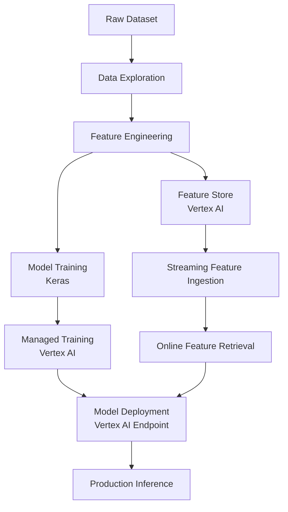

# End-to-End ML System Architecture

This repository showcases a comprehensive machine learning workflow executed on Google Cloud using Vertex AI. The project aims to illustrate how a production-oriented machine learning system evolves from data exploration to feature management and model deployment. This architecture demonstrates the seamless integration of training pipelines, feature pipelines, and serving infrastructure within a modern machine learning platform.

The architecture reflects core machine learning engineering practices including:

- reproducible experimentation
- feature engineering pipelines
- managed model training
- deployment using Vertex AI
- feature store integration for real-time inference
- environment-based configuration for reproducibility

#### This architecture demonstrates how training pipelines, feature pipelines, and serving infrastructure interact within a modern ML platform.

---

## Repository Structure Overview

The repository is structured to reflect the major components of a production-oriented machine learning system on Google Cloud.  
Each directory represents a functional layer within the ML lifecycle and mirrors how real-world ML platforms separate responsibilities across data preparation, model training, deployment, and operations.

The structure intentionally separates experimentation (notebooks) from reusable code, infrastructure configuration, and operational artifacts.

---

## artifacts/

Stores generated outputs produced during model training and experimentation.

Typical contents include:

- trained model artifacts
- evaluation outputs
- serialized models
- experiment outputs

In production systems, these artifacts are often stored in artifact registries or object storage such as Google Cloud Storage.  
Within this repository they serve as local representations of those outputs.

---

## data/

Contains datasets used during experimentation and model development.

Structure:

- **raw/** – original datasets prior to any transformation
- **processed/** – cleaned and feature-engineered datasets used for training
- **README.md** – documentation describing dataset structure and provenance

This separation mirrors common data engineering practices where raw data is preserved and transformations produce reproducible processed datasets.

---

## deployment/

Contains infrastructure configuration related to model deployment.

Examples include:

- endpoint configuration templates
- service configuration files
- deployment parameters

In a production environment, these files would be used to configure model endpoints, inference services, or infrastructure provisioning.

---

## docs/

Houses documentation related to system design, architectural decisions, and learning artifacts.

Typical documentation includes:

- architecture notes
- course artifact records
- design decisions
- exam preparation mapping

Maintaining architecture documentation alongside implementation helps ensure traceability between system design and technical execution.

---

## mlops/

Contains components related to machine learning operations and pipeline orchestration.

Structure may include:

- **pipelines/** – orchestration logic for training pipelines
- monitoring or operational configuration
- pipeline definitions used for automated workflows

This directory represents how ML pipelines would typically be automated in production environments using orchestration systems.

---

## src/

Contains reusable Python modules supporting the machine learning workflow.

Typical modules include:

- feature engineering utilities
- model definition logic
- training utilities
- evaluation helpers

Separating reusable code from notebooks follows standard software engineering practices and improves maintainability as projects grow.

---

## training/

Contains resources related to model training infrastructure.

Typical contents include:

- container configuration (Dockerfile)
- training entrypoints
- trainer modules

In production systems, these components support containerized training jobs executed in managed services such as Vertex AI custom training.

---

## notebooks/

Interactive notebooks demonstrating each stage of the machine learning lifecycle.

These notebooks illustrate the practical workflow used in the project, including:

- data exploration
- feature engineering
- model training
- managed training on Vertex AI
- model deployment
- feature store integration

The notebooks provide a transparent, step-by-step demonstration of the system architecture implemented in this repository.

---

## ML Notebook Workflow (Quick Reference)

**Execution Order:** 01 → 02 → 03

1. **01_exploration.ipynb**  
   - Explore raw dataset.  
   - Identify feature distributions, missingness, and correlations.  
   - Output: insights for feature engineering.

2. **02_feature_engineering.ipynb**  
   - Clean and transform features.  
   - Save processed dataset locally and optionally to GCS (`DATA_PREP_PREFIX/train_processed.csv`).  
   - Best Practices:
     - Run `auth.authenticate_user()` for GCS access.
     - Local save is authoritative; GCS push is optional but portfolio-aligned.

3. **03_training_keras_vertex.ipynb**  
   - Load processed dataset (`DATA_PREP_PREFIX/train_processed.csv`).  
   - Train Keras classifier.  
   - Evaluate:
     - Accuracy
     - ROC-AUC
     - Confusion Matrix
     - ROC curve + threshold analysis
   - Save model locally (`artifacts/training/model.keras`) and optionally to GCS (`TRAINING_PREFIX`).  
   - Portfolio-grade structure: initialization → dataset load → train → evaluate → save.

**Notes:**  
- Environment variables (`PROJECT_ID`, `DATA_PREP_PREFIX`, `TRAINING_PREFIX`, etc.) are critical.  
- Always maintain **01 → 02 → 03** sequence.  
- Optional GCS uploads require proper authentication (`auth.authenticate_user()`).
