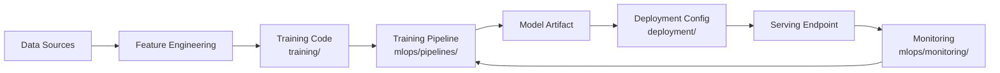
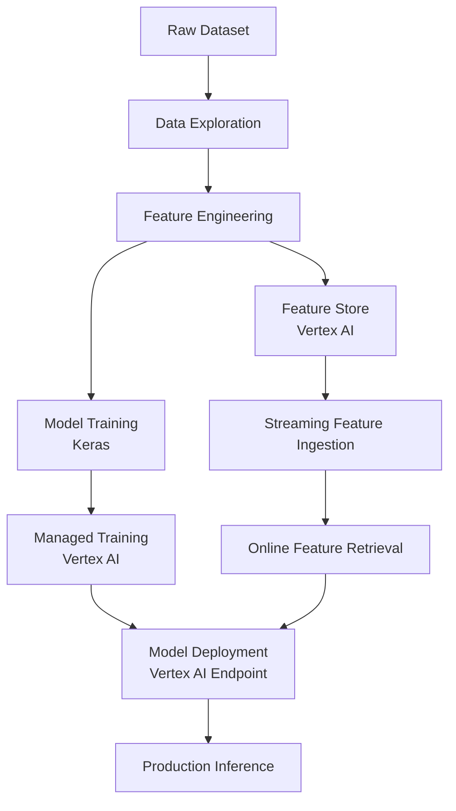

```mermaid
flowchart LR
    A[Data Sources] --> B[Feature Engineering]
    B --> C[Training Code<br/>training/]
    C --> D[Training Pipeline<br/>mlops/pipelines/]
    D --> E[Model Artifact]
    E --> F[Deployment Config<br/>deployment/]
    F --> G[Serving Endpoint]
    G --> H[Monitoring<br/>mlops/monitoring/]
    H --> D
```

This:

- Shows system boundaries
- Shows directory ownership
- Shows feedback loop
- Looks professional
- Signals architectural maturity

```mermaid
flowchart TD

A[Raw Dataset] --> B[Data Exploration]
B --> C[Feature Engineering]

C --> D[Model Training<br>Keras]
D --> E[Managed Training<br>Vertex AI]

E --> F[Model Deployment<br>Vertex AI Endpoint]

C --> G[Feature Store<br>Vertex AI]
G --> H[Streaming Feature Ingestion]
H --> I[Online Feature Retrieval]

I --> F

F --> J[Production Inference]
```
