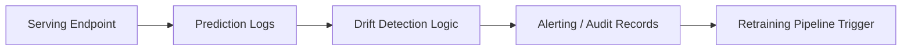

# Monitoring (Design Stub)

This directory documents where monitoring logic resides in the
production ML system.

## Monitoring Scope

- Data drift detection
- Prediction skew detection
- Concept drift detection
- Alerting and auditability

## Conceptual Flow

## Scope Boundaries

No live monitoring jobs are executed.
This is a design-level placeholder aligned with Course 11
production ML system architecture.